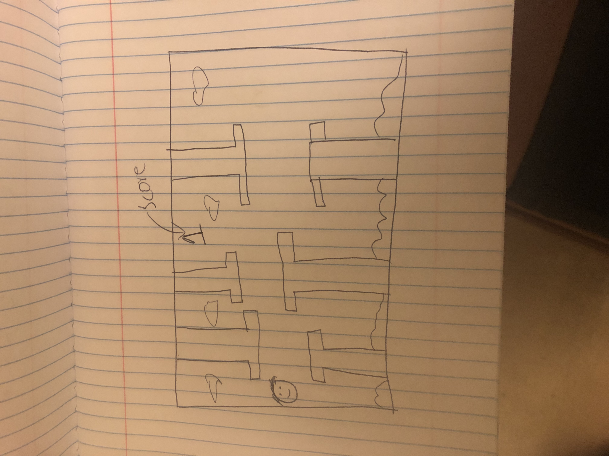
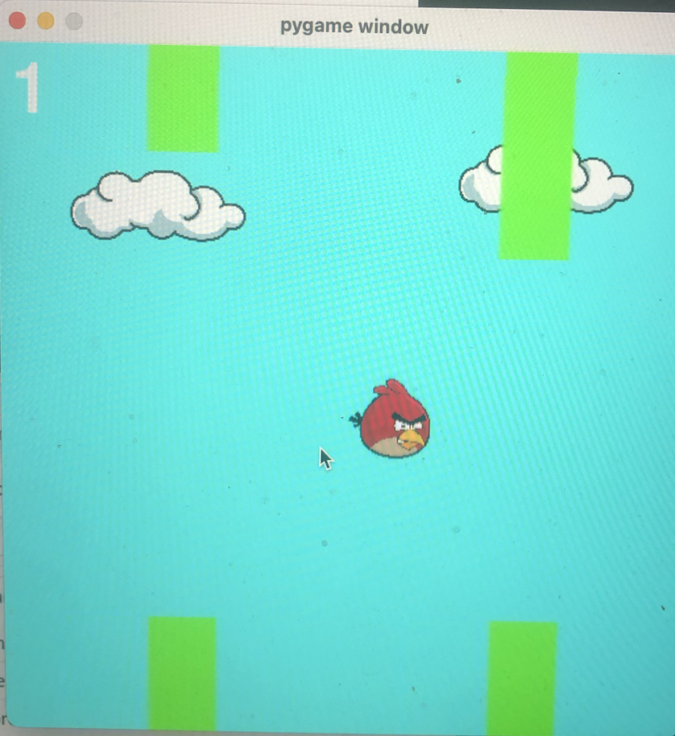

:warning: Everything between << >> needs to be replaced (remove << >> after replacing)

#  Angry Flap
## CS110 Final Project   Fall Semester, 2024 

## Team Members

Samuel Yu

***

## Project Description

I'm making a flappy bird game with the bird being red from angry birds. The game will have a start menu with the option to start the game. Once the game is started the user will have to press the space bar to move the bird up and avoid the pipes. With each pair of pipes the user goes through the score displayed on the screen will increase by one. If the user collides with one of the pipes the game ends and the user is brought to the end menu where they will have the option to start over or end the game. When you double tap the bird also accelerations more upward. 
***    

## GUI Design

### Initial Design

### Final Design

## Program Design

### Features

1. Start Menu 
2. Moving Background and Tubes 
3. Score Tracker 
4. Obstacle Collision 
5. Game Over Screen

### Classes

- Cloud - Makes the cloud image and puts it on the screen. It moves the clouds as the screen is moving 
- Controller- Controls the entire program. It controls the movement of the screen and all the actions of the user. 
- Player- Controls the user and makes the player up, and down and checks whether it makes contact with any of the pipes.
- Pipes- Makes the Pipes and generates the h eight for the top tip and the bottom. Also has a hitbox and checks whether the player hits the tubes 

## ATP

| Step                 |Procedure             |Expected Results                   |
|----------------------|:--------------------:|----------------------------------:|
|  1                   | Run Counter Program  |GUI window appears with a button to start the game  |
|  2                   | click startbutton    |Takes the user out of of the menu and into a new gui |
|  3                   | Press space bar      |Makes the angry bird go up 
|  4                   | Passes a pipe        |The score on the top right increases by 1 
|  5                   | Collides with a pipe |The end screen pops up and the user has the option to restart or end game 
|  6                   | User presses either button | The game either restarts or the GUI window ends 
